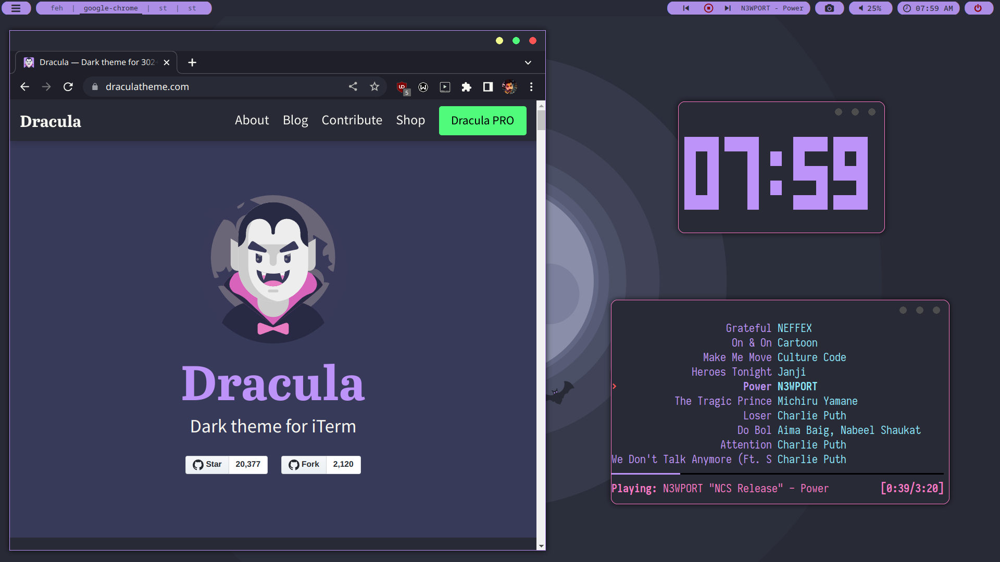

### DraculaBox
Minimal yet aesthetic Dracula themed Openbox rice.

## Screenshots:

  



#### About:
* **Openbox** as the Window Manager
* **Dracula** as the color scheme.
* **Dunst** as the notification daemon.
* **Polybar** as the bar.
* **Fish** as the Shell.
* **Picom** as the compositor.
* **JGMenu** as the desktop menu.
* **MPD** as the Music player.
* **St** as the terminal emulator.
* **Scrot** as the Screenshot Util. 
* **Nitrogen** as the Wallpaper Util.

<summary><b>Install Dependencies</b></summary>

```bash
yay -S openbox polybar jgmenu mpd mpc ncmpcpp dunst scrot pavucontrol pulseaudio fish feh mousepad cava google-chrome spotify rofi nitrogen zscroll wmctrl xorg-xprop xdotool --needed
```
<summary><b>Installing Dots:</b></summary>

```bash
git clone https://github.com/djkido316/DraculaBox.git
cd DraculaBox
cp -r .config ~/
cp .xinitrc .Xresources ~/
```
Install St(Siduck fork):
```bash
git clone https://github.com/siduck/st.git
cd st
sudo make install
```
Install Fonts:
```bash
mkdir -p ~/.local/share/fonts
cd fonts
mv * ~/.local/share/fonts/
fc-cache -fv
```
Install Icons:
```bash
mkdir -p ~/.local/share/icons
cd icons
mv * ~/.local/share/icons/
```
Install GTK & Openbox themes:
```bash
mkdir -p ~/.themes
cd themes
mv * ~/.themes
```
### All Done!

